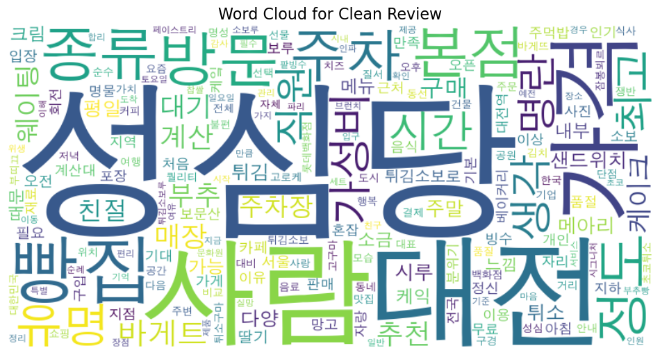

# YBIGTA Newbie Team Project

# 팀 소개

TEAM 1

- **이재영**: 안녕하세요~ 저는 응용통계학과 21학번 이재영입니다! 데이터 관련 프로젝트를 좋아해서 da 팀으로 지원했습니다!! 반갑습니다 :)
- **송휘린**: 안녕하세요!! 저는 응통 23학번 송휘린입니다. 모든게 초보지만 열심히 배우겠습니다.
- **강정묵**: 안녕하세요. 22학번 응용통계학과 강정묵입니다.

---
#DB/DOCKER/AWS 과제

##Docker hub 주소
Docker hub 주소 : https://hub.docker.com/repository/docker/sleepylee02/ybigta-api/general
Docker hub command : docker pull sleepylee02/ybigta-api:latest

##Api 실행
- delete-api

- login-api

- password-api

- register-api

- preprocess-diningcode

- preprocess-google

- oreprocess-kakao


##Github Action


---
# 성심당 리뷰 데이터 크롤링 프로젝트

## 데이터 소개

### 구글 맵
- 데이터 개수: 총 1000개  
- 데이터 형식: CSV  
- 열 이름: 리뷰, 날짜, 별점  
- 대상 지점 및 링크:
  - [성심당 DCC점](https://www.google.com/maps/place/%EC%84%B1%EC%8B%AC%EB%8B%B9+DCC%EC%A0%90/data=!4m8!3m7!1s0x3565498ff8570165:0x8cd47008647df355!8m2!3d36.3753313!4d127.3924207!9m1!1b1!16s%2Fg%2F11f0kvfpj0?entry=ttu&g_ep=EgoyMDI1MDEyMS4wIKXMDSoASAFQAw%3D%3D)  
  - [성심당 롯데백화점 대전점](https://www.google.com/maps/place/Sungsimdang+Bakery+Lotte+Daejeon+Branch/data=!4m8!3m7!1s0x3565495a46274a79:0x5b973bd3cfd7d125!8m2!3d36.3403653!4d127.3901764!9m1!1b1!16s%2Fg%2F1ptxmrrlz?entry=ttu&g_ep=EgoyMDI1MDEyMS4wIKXMDSoASAFQAw%3D%3D)  
  - [성심당 본점](https://www.google.com/maps/place/%EC%84%B1%EC%8B%AC%EB%8B%B9+%EB%B3%B8%EC%A0%90/data=!4m8!3m7!1s0x356548d8f73d355d:0x69e930d902c95eca!8m2!3d36.3276832!4d127.4273424!9m1!1b1!16s%2Fg%2F1tct_8rr?entry=ttu&g_ep=EgoyMDI1MDEyMC4wIKXMDSoASAFQAw%3D%3D)  

### 카카오맵
- 데이터 개수: 총 1942개  
- 데이터 형식: CSV  
- 열 이름: 리뷰, 날짜, 별점  
- 대상 지점 및 링크:
  - [성심당 본점](https://place.map.kakao.com/17733090)  

### 다이닝 코드
- 데이터 개수: 총 228개  
- 데이터 형식: CSV  
- 열 이름: 리뷰, 날짜, 별점  
- 대상 지점 및 링크:
  - [성심당 본점](https://www.diningcode.com/profile.php?rid=LtMjLaf0kZJC)  

---

## 실행 방법

1. 디렉토리를 다음과 같이 설정합니다:  
   `YBIGTA_newbie_team_project/review_analysis/crawling`
2. 다음 명령어를 실행합니다:
   ```bash
   python main.py -o ../../database --all
3. 결과:
   `YBIGTA_newbie_team_project/database`에 `review_{사이트명}.csv`가 모두 생성됩니다.

---
## EDA/FE, 시각화
**1. 개별 EDA** 


   + 다이닝 코드: Weekly average star ratings- 초기에는 평점이 극단적으로 낮거나 높은 주가 간헐적으로 나타나며, 이후 비교적 안정적인 패턴을 보임, 2022년 이후부터 평균 평점이 비교적 4.5 ~ 5.0 사이에서 안정적으로 유지, 일부 주차에서 평균 평점이 2.0 근처로 급격히 하락한 경우가 관찰됨. 이는 특정 사건이나 서비스 품질 저하와 관련될 가능성이 있음. Average Star Ratings by Day of the Week- 수요일과 금요일이 각각 평균 4.84, 4.83으로 가장 높은 평점, 화요일이 평균 4.43으로 가장 낮은 평점을 보이며, 다른 요일과의 차이가 상대적으로 큼. 주중 중반부 또는 주말 직전에 방문 했을 때 가장 높은 사용자 만족도를 주는 것으로 보임. 주말보다 평일에 더 긍정적인 평가를 받음. Star Ratings Distribution- 5점 평점이 70프로 이상 차지하고 1 ~ 3점의 평점이 5프로 미만으로 매우 긍정적인 리뷰를 받고 있음.


   + 구글 맵: plot_review_length_distribution- 리뷰 길이가 짧은 데이터가 매우 많고 긴 데이터일 수록 빈도가 급격히 감소하는 long tail 형태를 보임, plot_rating_distribution- 4과 5점이 대부분의 리뷰를 차지하며 5점의 비율이 압도적으로 많은 것으로 보아 장소에 대한 긍정적인 평가가 보임, plot_date_distribution- 2023년부터 리뷰수가 급증하였고 2024년에 가장 많은 리뷰가 있음, 최신 데이터 집중 경향으로 과거 데이터가 상대적으로 부족함을 보임.


   + 카카오 지도: plot_rating_distribution- 평점 5.0의 데이터가 압도적으로 많고 대부분의 데이터가 4점 또는 5점으로 클래스 불균형 형태를 보임, 장소가 전반적으로 높은 사용자 만족도를 제공함을 의미, plot_review_length_distribution- 리뷰 길이가 50 이하인 데이터에 집중되어 있고, 긴 리뷰일수록 빈도가 점차적으로 감소하는 우측 왜도 형태를 보임, 이는 사용자가 간단한 의견만 남기거나 단어 수준의 짧은 피드백을 주로 작성했음을 의미함, plot_date_distribution- 초기 데이터가 부족하나 점차 리뷰 수가 증가함
   
**2. 개별 데이터 전처리/FE**
   + 다이닝 코드: 이 데이터 전처리 과정에서는 날짜, 별점, 그리고 한글 텍스트 데이터를 정리하여 분석 가능한 형태로 가공했습니다. 날짜 처리에서는 문자열 형태의 날짜를 표준화된 datetime 형식으로 변환하고, 요일, 주말 여부, 월 등의 추가 정보를 생성하여 분석에 활용할 수 있도록 준비했습니다. 별점 처리에서는 평점 5.0 데이터가 많은 클래스 불균형 형태를 보이는 데이터를 숫자로 추출하고, 결측값은 0으로 대체해 일관성을 유지했습니다. 한글 텍스트 전처리에서는 특수문자와 불필요한 내용을 제거한 뒤, Kiwi 라이브러리를 활용해 명사만 추출하고 짧은 단어를 제외하여 간결한 핵심 텍스트를 남겼습니다. 이를 통해 데이터의 품질을 높이고 분석 및 모델링에 적합한 구조로 변환했습니다.
   + 구글 맵: 리뷰 길이가 0인 데이터를 필터링하고 비정상적으로 긴 리뷰를 이상치처리 함, review_date 열을 pd.to_datetime으로 변환해 날짜 형식으로 처리, 변환 불가능한 값(결측치)은 dropna를 통해 제거, astype(str)를 사용해 리뷰 텍스트를 문자열로 강제 변환하여 계산 오류 방지, review_length: 리뷰 길이를 기반으로 짧은 리뷰와 긴 리뷰 간의 차이를 분석하거나, 분류/회귀 모델에 활용 가능, review_date를 날짜로 변환하여 시간 흐름에 따른 분석이 가능하도록 데이터 준비.
   + 카카오 지도: review_length- 리뷰 데이터(review)를 문자열로 변환한 뒤, 각 리뷰의 길이를 계산해 텍스트 기반 데이터를 정량화하여 분석에 적합하게 변환, date- pd.to_datetime을 사용하여 date 열을 날짜 형식으로 변환하여 를 시계열 분석이나 분포 분석에 적합하도록 정리,

**3. 비교분석 결과**


   + 최종 결과: Top Sentiment Label Distribution에서는 즐거움, 신남, 기대감, 감동 등 긍정적인 감정의 빈도가 압도적으로 높아 방문자들에게 대체로 긍정적인 경험을 제공하고 있음을 알 수 있습니다. 그러나 안타까움과 실망의 빈도 또한 150 이상으로 나타나며, 일부 사용자들이 기대에 부응하지 못한 부정적인 경험을 했을 가능성을 시사합니다. 긍정적인 감정은 장소의 신뢰와 만족감에서 비롯된 것으로 보이며, 부정적인 감정은 기대감이 충족되지 못한 실망감에서 기인한 것으로 추측됩니다.


   + 최종 결과: Top 5 Sentiment Frequencies Comparison에서는 모든 데이터셋에서 즐거움과 신남이 가장 높은 비중을 차지했으며, 기대감과 감동 또한 빈도가 높아 긍정적인 감정이 주를 이루고 있음을 보여줍니다. Kakao와 Google 데이터는 긍정적인 감정의 비중이 상대적으로 높았지만, DiningCode 데이터는 감정 표현이 상대적으로 제한적이었습니다. 전반적으로 각 플랫폼에서 긍정적인 사용자 경험이 드러났지만, 일부 부정적인 감정(안타까움/실망)도 데이터셋별로 나타나 개선의 여지가 있을 수 있습니다.



   + 최종 결과: Word Cloud for Clean Review에서는 친절, 주차장, 분위기, 맛집, 매장 등 장소의 서비스와 편의성을 중심으로 한 긍정적인 키워드가 두드러집니다. 이는 사용자들이 장소의 환경과 서비스에 대해 만족감을 표현했음을 의미합니다. 부정적인 키워드는 거의 나타나지 않았으며, 리뷰의 전반적인 맥락이 긍정적인 사용자 경험에 초점을 맞추고 있음을 알 수 있습니다. 이러한 리뷰 키워드는 방문자의 기대와 신뢰를 충족시키는 요소가 중요하다는 점을 보여줍니다.

------

# Git Environment Setup

## Branch Protection Rule


## Push Rejected Example


## Merged Branches


---

# FastAPI 프로젝트
이 프로젝트는 FastAPI를 기반으로 사용자 관리 기능(로그인, 회원가입, 계정 삭제, 비밀번호 변경)을 제공하는 웹 애플리케이션입니다. 사용자는 간단한 절차를 통해 계정을 생성하고, 로그인하여 서비스를 이용할 수 있습니다.

---

## 사용 방법

### **1. 가상환경 설정 및 서버 실행**

1. **가상환경 활성화**:
   - 터미널 또는 명령 프롬프트에서 프로젝트 디렉토리로 이동 후, 아래 명령어를 실행합니다.
     - Windows:
       ```bash
       venv\Scripts\activate
       ```
     - Linux/Mac:
       ```bash
       source venv/bin/activate
       ```

2. **서버 실행**:
   - 아래 명령어를 입력하여 FastAPI 서버를 실행합니다:
     ```bash
     uvicorn app.main:app --reload
     ```
   - 실행 후, 터미널에 `Uvicorn running on http://127.0.0.1:8000`와 같은 메시지가 출력됩니다.

---

### **2. 웹페이지 접속 및 테스트**

1. **HTML 페이지 접속**:
   - 웹 브라우저를 열고 다음 URL을 입력합니다:
     ```
     http://127.0.0.1:8000/static/index.html
     ```
   - 페이지가 열리면 회원가입, 로그인, 비밀번호 변경, 계정 삭제 기능을 사용할 수 있습니다.

2. **회원가입**:
   - **회원가입 섹션**에서 다음 정보를 입력합니다:
     - 이메일 주소
     - 비밀번호
     - 사용자 이름
   - **회원가입 버튼**을 클릭하면 계정이 생성됩니다.
   - 성공 메시지가 표시되면 회원가입이 완료된 것입니다.

3. **로그인**:
   - **로그인 섹션**에서 이메일과 비밀번호를 입력합니다.
   - **로그인 버튼**을 클릭하면 로그인 성공 여부가 화면에 표시됩니다.
   - 성공적으로 로그인되면 환영 메시지가 나타납니다.

4. **비밀번호 변경**:
   - 로그인한 상태에서 **비밀번호 변경 섹션**으로 이동합니다.
   - 새 비밀번호를 입력한 뒤, **변경 버튼**을 클릭합니다.
   - 성공 메시지가 나타나면 비밀번호가 변경된 것입니다.

5. **계정 삭제**:
   - 로그인한 상태에서 **계정 삭제 섹션**으로 이동합니다.
   - **삭제 버튼**을 클릭하면 계정이 삭제됩니다.
   - 성공 메시지가 표시되며, 계정이 삭제되고 로그아웃됩니다.

---

## 문의 사항

서비스 이용 중 문제가 발생하거나 도움이 필요하면 관리자에게 문의하세요.
- 이메일: nickjmk1006@gmail.com

